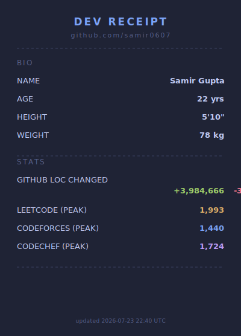

<table border="0" cellspacing="0" cellpadding="10" align="center">
<tr>
<td valign="top">

</td>
<td valign="top" align="center">

</td>
</tr>
</table>
 
<picture>
  <source media="(prefers-color-scheme: dark)" srcset="https://raw.githubusercontent.com/samir0607/samir0607/output/github-snake-dark.svg" />
  <source media="(prefers-color-scheme: light)" srcset="https://raw.githubusercontent.com/samir0607/samir0607/output/github-snake.svg" />
  
</picture>

### Connect with me

&nbsp;&nbsp;

&nbsp;&nbsp;

&nbsp;&nbsp;

### Coding profiles

&nbsp;&nbsp;

&nbsp;&nbsp;

### Tech stack

 

